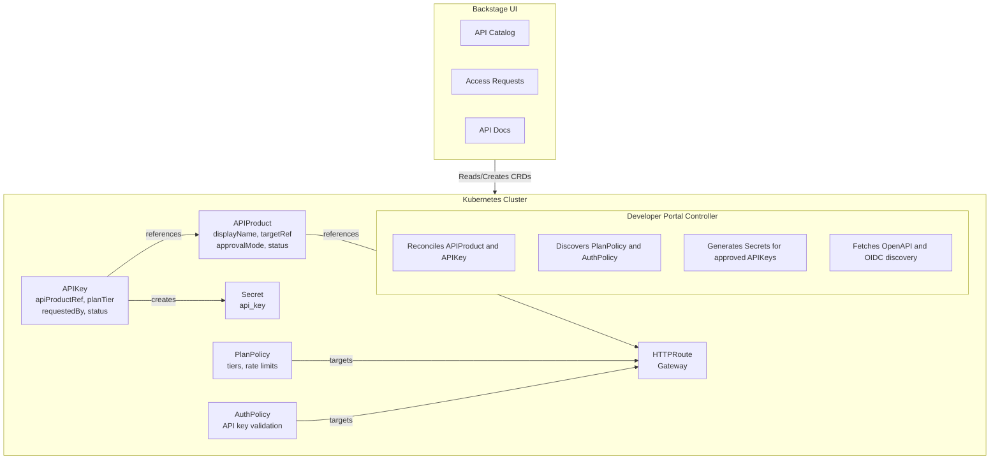

# Kuadrant Backstage Plugin Overview

The Kuadrant Backstage Plugin brings API access management, Gateway visibility, and MCP (Model Context Protocol) inspection into Backstage. Platform engineers can monitor MCP infrastructure, while API owners and consumers use the Developer Portal to publish APIs and manage access.

The Developer Portal brings self-service API access management to Kubernetes-native organizations. It bridges the gap between API providers who want to share their services and developers who need to consume them, providing a structured workflow for API discovery, access requests, and credential management.

## Gateway Visibility

The plugin shows the Gateways targeted by MCPGatewayExtension resources and the HTTPRoutes attached to those Gateways. This connects the MCP service view to the underlying Gateway API routing infrastructure.

You can:

- View Gateway health, namespace, and GatewayClass
- Inspect Gateway metadata, status conditions, and resource YAML
- View attached HTTPRoutes and their routing and policy enforcement status
- Inspect HTTPRoute metadata, status conditions, and resource YAML

A Gateway is healthy when both its `Accepted` and `Programmed` conditions are `True`. HTTPRoute status reflects route acceptance and the enforcement conditions reported by Kuadrant policies.

## MCP Management

The MCP management overview brings Gateways, gateway extensions, server registrations, and attached HTTPRoutes together. Summary cards show Gateway health and registered server readiness, while searchable tables help you find resources by name, namespace, or status.

Two MCP resources describe the gateway and its servers:

- **MCPGatewayExtension** extends a Gateway with MCP capabilities and identifies the Gateway through `spec.targetRef`.
- **MCPServerRegistration** registers an MCP server behind an HTTPRoute, with a prefix that identifies its tools through the gateway.

Resource detail views show metadata, status conditions, target references, and YAML. A registered server is shown as online when its `Ready` condition is `True`.

The Backstage permission framework controls access to Gateway, HTTPRoute, gateway extension, and server registration views. The backend uses its configured Kubernetes identity to discover these resources.

## MCP Inspector

The MCP Inspector lets you explore what a gateway exposes and test its tools and prompts from Backstage:

- Discover available tools and prompts, and search the tool catalog
- Build tool inputs from JSON schemas and validate them before execution
- Run tools and inspect their results alongside the JSON-RPC request and response
- Supply prompt arguments and review the generated prompt text
- Connect using automatic protocol discovery or an explicit protocol version
- Provide a bearer token when the gateway requires authentication

The Backstage backend relays Inspector requests to the selected MCP gateway. Bearer tokens and MCP session IDs are held in browser memory, and the `kuadrant.mcp.inspector.use` permission controls access to the Inspector.

See the [MCP Inspector guide](mcp-inspector.md) for connection details and usage.

## The Problem: API Access at Scale

Organizations running microservices on Kubernetes face a common challenge: how do you let developers both internal and external discover and consume your APIs safely and efficiently?

Without a structured approach, teams resort to ad-hoc solutions:

- Sharing API keys through Slack messages or wikis
- Manual onboarding processes that don't scale
- No visibility into who is using which APIs
- Inconsistent rate limiting and access controls
- APIs that exist but remain undiscoverable

The Developer Portal addresses this by providing a Kubernetes-native system where APIs are cataloged, access is requested through a formal workflow, and credentials are managed automatically.

## How It Works

The Developer Portal introduces two Custom Resource Definitions (CRDs) that model API products and access requests:

**APIProduct** represents an API offering. It wraps an existing HTTPRoute with the business context needed for consumption: a human-readable name, documentation links, contact information, and access policies. When an API owner creates an APIProduct and sets its `publishStatus` to `Published`, it becomes discoverable in the Backstage developer portal.

**APIKey** represents a developer's request for API access. It captures the requester's identity, their intended use case, and their desired service tier. Depending on the APIProduct's approval mode, the request is either automatically approved or queued for manual review. Upon approval, the controller generates secure credentials stored as Kubernetes Secrets.

This model means that API access follows the same patterns as other Kubernetes resources: declarative, auditable, and managed through standard tooling.

## Authentication Methods

The Developer Portal supports two authentication methods for protecting APIs. The method is configured at the platform level via AuthPolicy and automatically discovered by the controller.

### API Key Authentication

API key authentication uses Kubernetes Secrets to store credentials. This method involves a request and approval workflow:

1. API consumer creates an APIKey resource requesting access
2. Depending on the APIProduct's `approvalMode`:
   - **Manual**: Request enters `Pending` state, awaiting API owner approval
   - **Automatic**: Request is immediately approved by the controller
3. Upon approval, the controller generates a Secret containing the API key
4. Consumer retrieves the key from Backstage and uses it in API requests
5. AuthPolicy validates incoming requests against the generated Secrets

This method is ideal for internal APIs, development environments, or scenarios where you want fine-grained control over who can access your API.

### OIDC/JWT Authentication

OIDC (OpenID Connect) authentication delegates credential management to an external identity provider. There is no request/approval workflow in the Developer Portal:

1. Platform engineer configures AuthPolicy with JWT validation pointing to an OIDC issuer
2. The controller discovers the JWT authentication scheme and performs OIDC discovery to find the token endpoint
3. Discovered authentication details are surfaced in the APIProduct status
4. API consumer views the identity provider URL and token endpoint in Backstage
5. Consumer obtains a JWT token directly from the identity provider (e.g., using client credentials flow or any other available flow)
6. Consumer uses the JWT token in API requests
7. AuthPolicy validates the token's signature and claims against the OIDC issuer

This method is ideal for APIs that integrate with existing identity providers (Keycloak, Auth0, Azure AD, etc.), need stronger authentication, or require integration with enterprise SSO systems. No APIKey resources are created—access control happens at the identity provider level.

## Developer Portal Personas

The Developer Portal serves four distinct personas, each with different concerns and workflows.

### 1. The API Consumer

API consumers are developers who need to integrate with services provided by other teams. They experience the portal primarily through Backstage, where they can:

- Browse a catalog of available APIs with descriptions, documentation links, and OpenAPI specifications
- See what service tiers are available and their associated rate limits
- View authentication requirements and obtain credentials

The authentication experience depends on how the API is protected:

**For API Key Authentication:**

- Request access by creating an APIKey resource (either directly or through the Backstage UI)
- Receive an API key once their request is approved (credentials are shown once and must be saved immediately)
- Use the API key in the `Authorization` header when making requests

**For OIDC/JWT Authentication:**

- View the OIDC provider details and token endpoint
- Obtain an access token from the identity provider using their client credentials
- Use the JWT token in the `Authorization` header when making requests
- No APIKey resource is needed, authentication is handled by the external identity provider

From the consumer's perspective, the value is discoverability and self-service. Rather than searching through wikis or asking colleagues, they find what they need in a single catalog. The portal surfaces the authentication method and provides clear guidance on how to obtain credentials, whether through the API key request workflow or by interacting with an OIDC provider.

### 2. The API Owner

API owners are the teams responsible for specific services. They control how their APIs are presented and accessed:

- Define how the API appears in the catalog through APIProduct metadata
- For API key authentication:
  - Choose between automatic and manual approval for access requests
  - Review pending access requests and approve or reject them
- Set documentation links so consumers can self-serve

The authentication and approval workflow depends on the authentication requirements set by the platform engineering team. For **API key authentication**, owners can choose between automatic approval (useful for development environments or internal tooling) and manual approval (for production APIs requiring human review). The `approvalMode` field on APIProduct lets owners make this choice per-API.

For **OIDC/JWT authentication**, there is no config required. Access control is managed entirely by the external identity provider.

### 3. The API Admin

API Admins provide cross-team oversight and governance without being infrastructure-focused platform engineers. They bridge the gap between individual API owners and the platform team:

- View and manage all API Products across the organization, regardless of ownership
- Approve or reject any API key request, enabling centralized governance
- Troubleshoot issues on behalf of API Owners
- Ensure consistency across API Products (naming, documentation standards, etc.)

This role is particularly valuable in larger organizations where individual API owners may be unavailable, or where a central team needs visibility into all API access for compliance or security reasons. Unlike platform engineers, API Admins work within the Developer Portal rather than managing the underlying infrastructure.

### 4. The Platform Engineer

Platform engineers install and configure the Developer Portal infrastructure. Their responsibilities include:

- Deploying the Developer Portal Controller and Backstage plugin
- Creating HTTPRoutes and annotating them for exposure to API owners
- Configuring AuthPolicy resources for authentication:
  - API key validation using Kubernetes Secrets
  - OIDC/JWT validation with external identity providers
- Defining PlanPolicy resources that specify rate limit tiers
- Setting up RBAC so appropriate users can create, approve, and manage resources

The platform team doesn't need to be involved in individual API publications or access requests — those are handled by API owners and consumers. Instead, they establish the guardrails and infrastructure that make self-service possible. When configuring OIDC authentication, platform engineers work with identity provider administrators to obtain issuer URLs and configure the AuthPolicy accordingly.

## Architecture

The Developer Portal consists of several components working together:

The flow works as follows:

1. **Platform engineers** create HTTPRoutes (standard Gateway API routing) and attach PlanPolicy (rate limits) and AuthPolicy (authentication)
2. **API owners** select an available HTTPRoute and create an APIProduct that adds catalog metadata
3. The **controller** discovers these policies and updates the APIProduct status with available plans
4. **Backstage** reads APIProduct resources and displays them in the catalog
5. **Consumers** browse the catalog and create APIKey resources to request access
6. The **controller** processes APIKey requests, auto-approving or waiting for manual approval based on the APIProduct's configuration
7. Upon approval, the **controller** generates a Secret containing the API key
8. The **consumer** retrieves their key and uses it to authenticate API requests
9. **AuthPolicy** validates incoming requests against the generated Secrets
10. **PlanPolicy** enforces rate limits based on the consumer's selected tier

## Integration with Kuadrant

The Developer Portal is designed as part of the Kuadrant ecosystem. It builds on:

- **Gateway API**: The standard Kubernetes API for traffic routing. APIProduct references HTTPRoute.
- **Kuadrant AuthPolicy**: Enforces authentication at the gateway level. The controller discovers AuthPolicy configurations and surfaces authentication details to consumers:
  - **For API key authentication**: The controller creates Secrets with labels that AuthPolicy (via Authorino) uses for validation
  - **For OIDC/JWT authentication**: The controller discovers the JWT issuer URL from the AuthPolicy, performs OIDC discovery to find the token endpoint, and surfaces both to consumers in the Backstage UI
- **PlanPolicy**: A Kuadrant extension for tiered rate limiting. The controller discovers plan definitions and surfaces them to consumers.

This integration means the Developer Portal doesn't duplicate functionality, it adds the product catalog and credential discovery workflow on top of existing traffic management and policy enforcement. Whether using API keys or OIDC, authentication is always enforced by Kuadrant's AuthPolicy—the Developer Portal simply makes the authentication requirements discoverable and, for API keys, manages the credential lifecycle.

## Next Steps

- [Getting Started Tutorial](getting-started.md): Set up a complete example with an API product and access request
- [Installation Guide](installation.md): Deploy the Developer Portal Controller to your cluster
